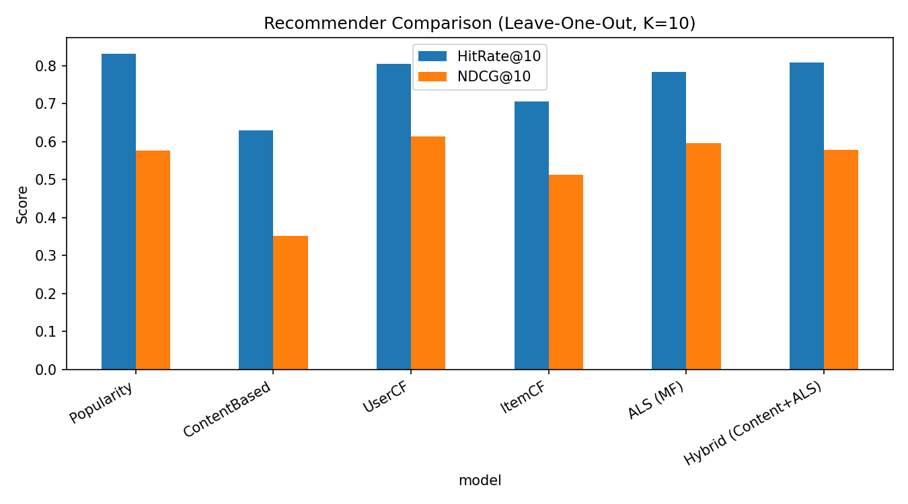

# 추천시스템 확장 & 비교 결과

기존에 있던 `가중치 부여 + {lightgbm, randomforest, xgboosting}.ipynb` 3개는 사실 **같은 파이프라인**(장르 12개 one-hot + rating → 분류기)에 분류기만 바꿔 끼운 구조였습니다. 그래서 "여러 방식 비교"라기보다는 "같은 방식, 다른 모델"에 가까웠어요.

이번에 추가한 건 데이터 자체를 보는 관점이 다른 추천 방식들입니다 (협업 필터링 계열 요청에 맞춰서):

| 모델 | 방식 | 무엇을 보는가 |
|---|---|---|
| Popularity | 비개인화 베이스라인 | 전체 유저가 많이 한 게임 |
| ContentBased | 콘텐츠 기반 | 유저 장르 선호 벡터 ↔ 게임 장르 벡터 코사인 유사도 (최종모델.md에서 설명한 방식 그 자체를 구현) |
| UserCF | 협업 필터링 (유저 기반 kNN) | "나랑 취향 비슷한 유저들이 뭘 했는가" |
| ItemCF | 협업 필터링 (아이템 기반 kNN) | "내가 한 게임과 같이 플레이되는 게임이 뭔가" |
| ALS (MF) | 협업 필터링 (행렬 분해) | 유저·아이템을 잠재 요인(latent factor)으로 분해해서 예측 |
| Hybrid | 콘텐츠 + ALS 가중합 | 두 신호를 섞어서 보완 |

기존 LightGBM/RF/XGBoost 계열은 **유저 1명씩 실행 시점에 API로 조회해서 그때그때 학습하는 구조**라 이 비교 프레임에 그대로 넣기 어려웠습니다 (아래 "기존 노트북에 대해" 참고). 필요하면 이 프레임 위에 다음 단계로 추가할 수 있습니다.

## 평가 방법

- **Leave-One-Out**: 유저마다 실제로 플레이한 게임 중 1개(가능하면 최근 플레이 게임)를 정답으로 숨김
- 그 정답 게임 1개 + 유저가 안 해본 게임 중 무작위 99개, 총 100개 후보 중에서 각 모델이 몇 위로 추천하는지 확인
- 지표: HitRate@10 (10위 안에 정답이 있었는가), NDCG@10 (순위까지 반영한 점수)

## 결과 (전체 878명 유저 기준)

| model | HitRate@10 | Precision@10 | Recall@10 | NDCG@10 |
|---|---|---|---|---|
| Popularity | 0.8318 | 0.0832 | 0.8318 | 0.5764 |
| ContentBased | 0.6290 | 0.0629 | 0.6290 | 0.3520 |
| UserCF | 0.8049 | 0.0805 | 0.8049 | **0.6134** |
| ItemCF | 0.7047 | 0.0705 | 0.7047 | 0.5135 |
| ALS (MF) | 0.7831 | 0.0783 | 0.7831 | 0.5958 |
| Hybrid | 0.8074 | 0.0807 | 0.8074 | 0.5773 |

**해석**

- Popularity가 HitRate만 보면 1등처럼 보이지만, 이건 이 데이터셋 특성상 흔한 함정입니다. 후보 100개 중에 인기 게임(Terraria, Stardew Valley 등 다들 갖고 있는 게임)이 섞여 있으면 "그냥 인기순으로 찍어도" 맞을 확률이 높아요. 실제 서비스에서 의미 있는 건 **NDCG** (몇 등으로 맞췄는지)와, 아는 게임만 계속 추천하는 게 아니라 **새로운 걸 발견하게 해주는지(커버리지)** 입니다.
- **NDCG 기준으로는 UserCF가 가장 좋음** — 취향이 비슷한 다른 유저의 행동을 보는 게, 장르 라벨 몇 개보다 훨씬 정교한 신호라는 뜻입니다.
- **ContentBased(=현재 최종모델.md에 설명된 방식)가 가장 낮음** — 장르 12개짜리 벡터만으로는 표현력이 부족합니다. `features.py`에서 만든 태그 40개, 가격, 리뷰수 같은 feature까지 유사도 계산에 넣으면 개선될 여지가 큽니다 (이번엔 장르만으로 우선 baseline을 맞췄어요).
- ALS/Hybrid는 UserCF와 Popularity 사이 — 데이터가 878명 x 3564게임이라 행렬분해가 진가를 발휘하기엔 다소 작은 데이터셋입니다. 유저/아이템 수가 늘어나면 ALS 쪽이 유리해질 가능성이 높습니다.

## 추가로 만든 feature (`features.py`)

**게임 feature (`data/processed/game_features.csv`, 465개 게임 x 65컬럼)**
- 장르 12개 multi-hot (기존)
- **태그 상위 40개 multi-hot** (신규 — "Souls-like", "Roguelike" 같은 장르보다 세밀한 취향 반영)
- 싱글/멀티/코옵 여부 (categories 파싱)
- price, rating, review_count, log(review_count), positive_ratio
- release_year, game_age_years

**유저 feature (`data/processed/user_features.csv`, 779명 x 59컬럼)**
- 장르 선호 벡터 (기존 `user_genre_weights.csv`와 동일 로직, 재계산)
- **태그 선호 벡터** (신규)
- num_games, total_playtime_hours, avg_playtime_hours
- **genre_entropy** (신규 — 취향이 한 장르에 몰려있는지 다양한지)
- recent_playtime_ratio (최근 활동 비중)

## 기존 노트북(LightGBM/RF/XGBoost)에 대해

세 노트북(`notebooks/legacy/`)을 코드까지 다 확인했고, 구조적으로 아래 문제가 있어서 이번 878명 배치 비교에는 포함하지 않았습니다. 문제 자체는 `src/recommenders/classifier_based.py`로 통합·정리했습니다.

1. **1명 실행 = 1개 모델 학습.** `input()`으로 Steam ID 하나 받아서, 그 유저가 top500 중 플레이한 게임(positive) vs 안 한 게임(negative)만으로 매번 새로 학습합니다. 학습 샘플이 유저 1명당 최대 수십 개뿐이라 일반화가 거의 불가능하고, 878명 전체를 배치로 비교하는 이 프레임과는 애초에 설계가 다릅니다. (`classifier_based.py`도 이 구조는 그대로 유지 — 완전히 다른 배치 모델로 바꾸려면 별도 작업 필요)
2. **✅ 처리함 — Steam API Key.** 코드에 평문으로 박혀서 git에 커밋되어 있던 것(`STEAM_API_KEY = "B1FC36..."`, 3개 노트북 전부)을 `os.getenv("STEAM_API_KEY")` + `.env`로 교체했습니다. **단, 키 자체의 재발급은 저장소 소유자가 Steam 개발자 페이지에서 직접 해야 합니다** — 아직 안 했다면 지금 하세요.
3. **✅ 처리함 — 경로/파일명.** `C:\Users\User\...` 하드코딩과 `steam_user_games_merged.csv`(존재하지 않는 파일명) 참조를 `data/processed/` 기준 상대경로로 고쳤습니다.
4. **✅ 처리함 — 중복 코드.** 노트북 3개(분류기 15줄 정도만 다름)를 `classifier_based.py` 하나로 통합하고, `MODEL_REGISTRY`에서 `model_type`(`lightgbm` / `random_forest` / `xgboost`)만 바꿔 끼우는 구조로 정리했습니다. 실행: `python -m recommenders.classifier_based --steam-id <ID> --model lightgbm`

878명 배치 비교에 이 분류기 계열을 넣고 싶으면, "유저 1명당 즉석 학습" 대신 "장르/태그/수치 feature + 유저 feature를 합쳐서 (유저, 게임) pair 단위로 좋아함/안좋아함을 예측하는 하나의 글로벌 모델"로 바꾸는 걸 추천합니다. 원하면 다음 단계로 만들어 드릴게요.
